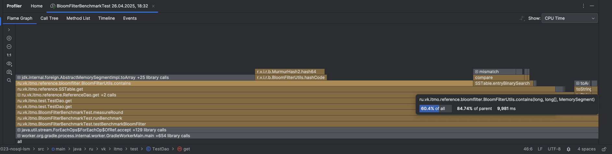
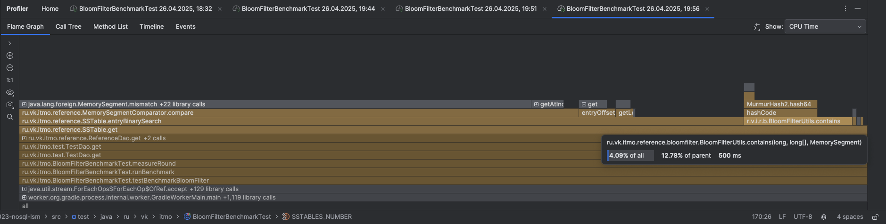

### Зависимость результатов от количества записей в SSTable и количества SSTable

| Bloom Enabled | Filter Size | FP Rate | Unexist Probability | Expected Insertions | Entries per table | SSTables | AVG nanos per GET |
|---------------|-------------|---------|---------------------|---------------------|-------------------|----------|-------------------|
| true          | 1000        | 0,01000 | 0,50                | 1000                | 1000              | 1        | 2163094,53        |
| false         | -           | -       | 0,50                | -                   | 1000              | 1        | 2098443,73        |
| true          | 1000        | 0,01000 | 0,50                | 1000                | 1000              | 10       | 11499506,16       |
| false         | -           | -       | 0,50                | -                   | 1000              | 10       | 16715028,81       |
| true          | 1000        | 0,01000 | 0,50                | 1000                | 1000              | 50       | 137153782,14      |
| false         | -           | -       | 0,50                | -                   | 1000              | 50       | 295377578,82      |
| true          | 1000        | 0,01000 | 0,50                | 1000                | 1000              | 100      | 633973983,28      |
| false         | -           | -       | 0,50                | -                   | 1000              | 100      | 1090194565,67     |
| true          | 2000        | 0,01000 | 0,50                | 2000                | 2000              | 10       | 22435154,00       |
| false         | -           | -       | 0,50                | -                   | 2000              | 10       | 34116716,06       |
| true          | 2000        | 0,01000 | 0,50                | 2000                | 2000              | 50       | 355692821,47      |
| false         | -           | -       | 0,50                | -                   | 2000              | 50       | 673078945,50      |
| true          | 2000        | 0,01000 | 0,50                | 2000                | 2000              | 100      | 1339021702,34     |
| false         | -           | -       | 0,50                | -                   | 2000              | 100      | 2516048226,12     |

### Выводы:

* При увеличении количества SSTable время выполнения операций GET возрастает практически линейно, даже при использовании
  Bloom-фильтра.  
  Это связано с тем, что в процессе бенчмарка запрашиваемая запись может находиться в одной из самых старых таблиц. В
  таком случае требуется итерация по всем предыдущим SSTable, что увеличивает время поиска.  
  Дополнительно, даже при наличии Bloom-фильтра вероятность ложного срабатывания не равна нулю, из-за чего происходит
  ненужный просмотр некоторых таблиц.

* Использование Bloom-фильтра позволяет значительно сократить среднее время поиска, особенно при большом количестве
  SSTable.  
  Это объясняется тем, что перед обходом таблицы осуществляется проверка через фильтр: если значение отсутствует,
  таблица пропускается, что экономит время на её просмотр.

### Особый случай: одна большая таблица

В ситуации с одной крупной SSTable разрыва в производительности практически нет:

| Bloom Enabled | Filter Size | FP Rate | Unexist Probability | Entries per table | SSTables | AVG nanos per GET |
|---------------|-------------|---------|---------------------|-------------------|----------|-------------------|
| true          | 100000      | 0,01000 | 0,50                | 100000            | 1        | 84877167,94       |
| false         | 100000      | 0,00100 | 0,50                | 100000            | 1        | 84135947,18       |

### Большое количество маленьких таблиц

При большом количестве небольших SSTable разница в скорости выполнения становится заметной на порядок:

| Bloom Enabled | Filter Size | FP Rate | Unexist Probability | Expected Insertions | Entries per table | SSTables | AVG nanos per GET |
|---------------|-------------|---------|---------------------|---------------------|-------------------|----------|-------------------|
| true          | 1000        | 0,00100 | 0,50                | 1000                | 1000              | 100      | 775153460,53      |
| false         | 1000        | 0,00100 | 0,50                | 1000                | 1000              | 100      | 1154574430,35     |

Мне стало интересно почему так, вот моя гипотеза:

---

### Расчеты для 1000 записей и FP Rate = 0.001:

* Размер Bloom-фильтра (m) ≈ 14400 бит (округлено до 64).
* Количество хеш-функций (k) = 10.
* Операций бинарного поиска: ~10 (log₂(1000)).
  Затраты на поиск:
* С Bloom-фильтром:
    * В худшем случае: 10 расчетов хешей + 10 итераций бинарного поиска.
    * В лучшем случае: 10 расчетов хешей + мгновенный отказ (null).
* Без Bloom-фильтра:
    * В обоих случаях: 10 итераций бинарного поиска.

--- 
Расчеты для 100 000 записей и FP Rate = 0.001:

* Размер Bloom-фильтра (m) ≈ 1 437 759 бит.
* Количество хеш-функций (k) = 10.
* Операций бинарного поиска: ~16 (log₂(100000)).
  Затраты на поиск:
* С Bloom-фильтром:
    * В худшем случае: 10 расчетов хешей + 16 итераций бинарного поиска.
    * В лучшем случае: 10 расчетов хешей + мгновенный отказ (null).
* Без Bloom-фильтра:
    * В обоих случаях: 16 итераций бинарного поиска.

---

* Итого, при большом количестве записей мы тратим больше CPU в лучшем случае чем без Блум фильтра.

* При большом же количестве маленьких таблиц, мы тратим меньше CPU на лучший случай чем без Блум фильтра.

* Небольшая разница в скорости между вариантами с Bloom-фильтром и без него объясняется эффективностью бинарного поиска:
  даже при ложном срабатывании фильтра стоимость поиска ограничивается логарифмической сложностью по количеству записей.

### Зависимость результатов от процента наличия записей в SSTable

| Bloom Enabled | Filter Size | FP Rate | Unexist Probability | Entries per table | SSTables | AVG nanos per GET |
|---------------|-------------|---------|---------------------|-------------------|----------|-------------------|
| true          | 1000        | 0,01000 | 0,10                | 1000              | 10       | 11693909,12       |
| false         | -           | -       | 0,10                | 1000              | 10       | 14735802,66       |
| true          | 1000        | 0,01000 | 0,30                | 1000              | 10       | 11585244,89       |
| false         | -           | -       | 0,30                | 1000              | 10       | 15791918,12       |
| true          | 1000        | 0,01000 | 0,70                | 1000              | 10       | 11441639,15       |
| false         | -           | -       | 0,70                | 1000              | 10       | 16734939,08       |
| true          | 1000        | 0,01000 | 1,00                | 1000              | 10       | 10316206,78       |
| false         | -           | -       | 1,00                | 1000              | 10       | 17019023,06       |

### Выводы:

* При увеличении вероятности отсутствия запрашиваемого ключа (Unexist Probability) время выполнения операции поиска
  уменьшается. Это логично, т.к. Блум фильтр позволяет сразу пропустить таблицу вместо итерирования по ней.
* Без Bloom-фильтра задержка увеличивается по мере роста процента отсутствующих записей, в то время как с фильтром
  наблюдается даже небольшое улучшение производительности. Тут ситуация обратная - приходится проходить сразу по всем
  таблицам, чтобы понять, что значения нету.

### Зависимость результатов от процента false-positive в Блум фильтре

| Bloom Enabled | Filter Size | FP Rate | Unexist Probability | Entries per table | SSTables | AVG nanos per GET |
|---------------|-------------|---------|---------------------|-------------------|----------|-------------------|
| true          | 1000        | 0,10000 | 0,50                | 1000              | 10       | 12127792,11       |
| false         | -           | -       | 0,50                | 1000              | 10       | 16218086,70       |
| true          | 1000        | 0,20000 | 0,50                | 1000              | 10       | 14062764,69       |
| false         | -           | -       | 0,50                | 1000              | 10       | 16706061,01       |
| true          | 1000        | 0,30000 | 0,50                | 1000              | 10       | 16543610,37       |
| false         | -           | -       | 0,50                | 1000              | 10       | 16732419,47       |
| true          | 1000        | 0,40000 | 0,50                | 1000              | 10       | 17071100,78       |
| false         | -           | -       | 0,50                | 1000              | 10       | 16917365,92       |
| true          | 1000        | 0,50000 | 0,50                | 1000              | 10       | 15585027,73       |
| false         | -           | -       | 0,50                | 1000              | 10       | 16647619,19       |
| true          | 1000        | 0,60000 | 0,50                | 1000              | 10       | 15960757,03       |
| false         | -           | -       | 0,50                | 1000              | 10       | 16554133,38       |
| true          | 1000        | 0,70000 | 0,50                | 1000              | 10       | 17024939,90       |
| false         | -           | -       | 0,50                | 1000              | 10       | 16656950,55       |
| true          | 1000        | 0,80000 | 0,50                | 1000              | 10       | 17580075,72       |
| false         | -           | -       | 0,50                | 1000              | 10       | 18597213,53       |
| true          | 1000        | 0,90000 | 0,50                | 1000              | 10       | 18988321,48       |
| false         | -           | -       | 0,50                | 1000              | 10       | 19099204,58       |
| true          | 1000        | 1,00000 | 0,50                | 1000              | 10       | 25739409,26       |
| false         | -           | -       | 0,50                | 1000              | 10       | 17141170,22       |

### Выводы:

* При росте вероятности ложных срабатываний (False Positive Rate) эффективность Bloom-фильтра падает.
* При FP Rate ≈ 0,7–0,8 время операций с Bloom-фильтром становится сопоставимым с временем без него.
* При FP Rate > 0,8 использование Bloom-фильтра теряет смысл: накладные расходы на проверку фильтра начинают
  перевешивать его пользу.
* Особенно заметен скачок времени на уровне FP = 1,0 (100% ложных срабатываний), где задержка работы с фильтром
  превышает даже задержку без фильтра.

### Зависимость результатов от ожидаемого количества записей в Блум фильтре

| Bloom Enabled | Filter Size | FP Rate | Unexist Probability | Entries per table | SSTables | AVG nanos per GET |
|---------------|-------------|---------|---------------------|-------------------|----------|-------------------|
| true          | 10000       | 0,01000 | 0,50                | 1000              | 10       | 9960032,77        |
| false         | -0          | -       | 0,50                | 1000              | 10       | 21214091,23       |
| true          | 10000       | 0,01000 | 0,50                | 10000             | 10       | 139551221,49      |
| false         | -0          | -       | 0,50                | 10000             | 10       | 218592990,30      |
| true          | 10          | 0,01000 | 0,50                | 1000              | 10       | 21939143,97       |
| false         | -           | -       | 0,50                | 1000              | 10       | 17074852,84       |
| true          | 10          | 0,01000 | 0,50                | 1000              | 100      | 1589472382,82     |
| false         | -           | -       | 0,50                | 1000              | 100      | 1133874422,96     |

### Выводы:

* Если Bloom-фильтр сконфигурирован правильно (размер фильтра соответствует ожидаемому количеству записей), достигается
  максимальная эффективность (например, 10 000 записей при ожидаемых 10 000 вставок).
* Если фильтр слишком маленький (например, размер 10 записей вместо 1000 или 10 000), то его эффективность резко падает
  и время выполнения операций увеличивается. Т.к. чаще происходят false-positive проверки.

### Улучшение

Я решил отпрофилировать алгоритм и увидел, что операция по проверке наличия значения в Блум фильтра занимает в несколько раз больше CPU чем бинарный поиск.   
И самое ужасное, что, по сути, основная часть времени уходит на приведение ключа из MemorySegment -> byte[], т.е. даже не на подсчет хешей.

Я решил немного переписать алгоритм подсчета Хеша, теперь на вход принимается MemorySegment, а не byte[].   
Уже внутри алгоритма берем из MemorySegment нужные нам участки памяти. 

Теперь в проверке наличия записи в Блум фильтре и не видно толком ничего о конвертации ключа записи в byte[].  
К тому же поиск в Блум фильтре занимает значительно меньше времени чем бинарный поиск.

### Результаты оптимизации:

Бенчмарк считался для кейса, когда ун ас много маленьких SSTable.

| С оптимизацией | Bloom Enabled | Filter Size | FP Rate | Unexist Probability | Expected Insertions | Entries per table | SSTables | AVG nanos per GET |
|----------------|---------------|-------------|---------|---------------------|---------------------|-------------------|----------|-------------------|
| НЕТ            | true          | 1000        | 0,00100 | 0,50                | 1000                | 1000              | 100      | 775153460,53      |
| ДА             | true          | 1000        | 0,00100 | 0,50                | 1000                | 1000              | 100      | 452949493,50      |

По итогу, новая версия Блум фильтра в 1.7 раз быстрее предыдущей.